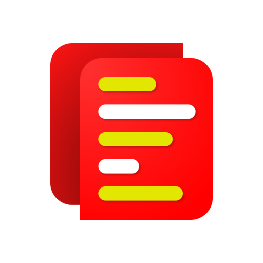
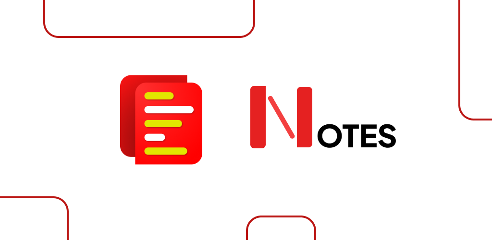
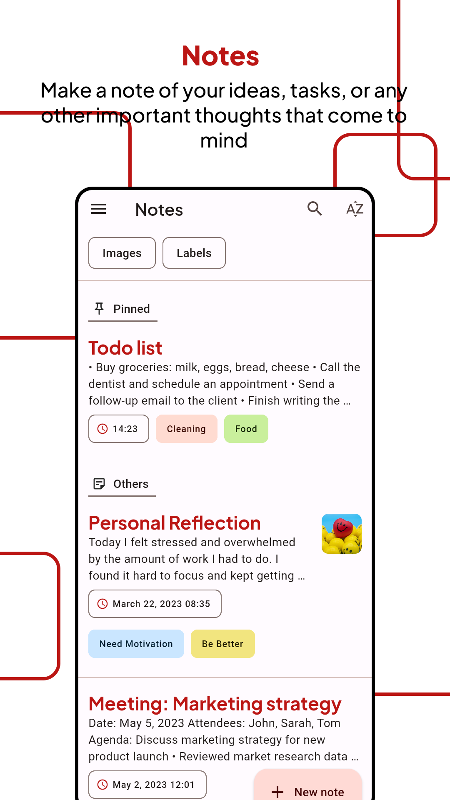
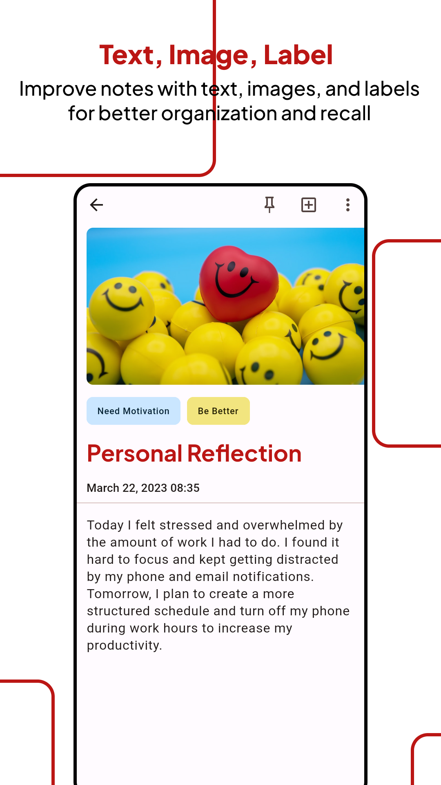
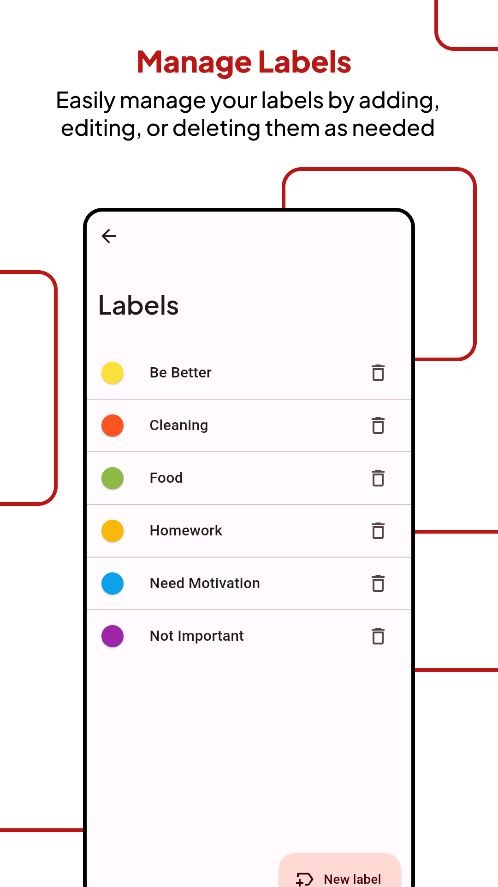
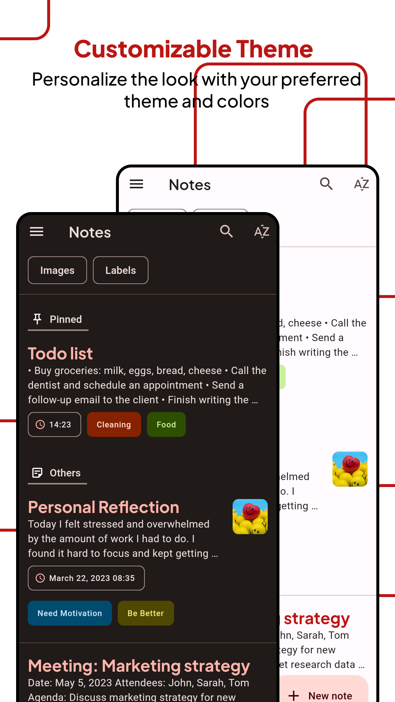

# Notes

## Header

## Screenshot

## What's new

- Bug fixes and added wide screen support
- Changed app icon

## Description

> Play store link: [Notes](https://play.google.com/store/apps/details?id=com.redmerah.notes)

Introducing our simple and intuitive notes app - the perfect tool to capture all your thoughts, ideas, and to-dos. With our app, you can easily create, edit, delete, archive, pin, or trash your notes.

Our notes app makes it easy for you to insert text, images, or labels to your notes, giving you the flexibility to customize your notes as you see fit. Plus, you can change the color of your labels for better organization, making it easier to find the notes you need.

Our app includes a search feature that allows you to quickly find notes by specific labels or images, saving you time and effort. Plus, with the light/dark theme option, you can customize the app to suit your personal preferences.

All notes are saved locally on your device, so you can be assured that your notes are always accessible, even when you're offline. However, please note that if you uninstall the app, all your notes will be permanently deleted.

Try our notes app today and discover the joy of organized note-taking!